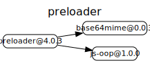
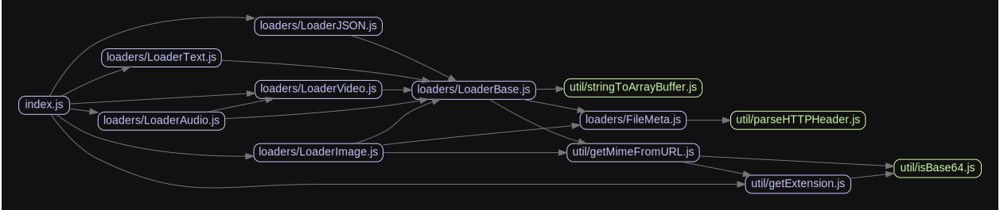

# 源码分析

## 文件结构

``` bash
/Users/liufang/openSource/FunnyLiu/preloader
├── LICENSE.md
├── README.md
├── api.md
├── index.js
├── lib
|  ├── index.js
|  ├── loaders
|  |  ├── FileMeta.js
|  |  ├── LoaderArrayBuffer.js
|  |  ├── LoaderAudio.js
|  |  ├── LoaderBase.js
|  |  ├── LoaderBlob.js
|  |  ├── LoaderImage.js
|  |  ├── LoaderJSON.js
|  |  ├── LoaderText.js
|  |  └── LoaderVideo.js
|  └── util
|     ├── arrayBufferToString.js
|     ├── getExtension.js
|     ├── getMimeFromURL.js
|     ├── isBase64.js
|     ├── parseHTTPHeader.js
|     └── stringToArrayBuffer.js
└── package.json

directory: 3 file: 24

ignored: directory (1)

```

## 外部模块依赖



## 内部模块依赖


  